# SwinV2-Large Receipt Classification Report

## 1. SwinV2-Large Architecture

The SwinV2-Large model is an advanced hierarchical vision transformer developed by Microsoft Research that addresses key limitations in scaling vision models. It builds upon the original Swin Transformer with several critical improvements for better stability and performance.

### Key Innovations in SwinV2

1. **Residual Post-Norm**: Replaces layer normalization before each block with a post-normalization configuration, improving training stability for large-scale models.

2. **Scaled Cosine Attention**: Introduces a cosine-based attention mechanism with a learnable temperature parameter, creating a more stable attention mechanism.

3. **Log-Spaced Continuous Position Bias**: Enables better transfer learning between different image resolutions through continuous position bias sampling.

4. **Self-Supervised Pre-training (SimMIM)**: Uses a masked image modeling approach for more effective pre-training with less labeled data.

### Architecture Diagram

```mermaid
graph TD
    subgraph "SwinV2-Large Architecture"
        Input["Input Image (192×192×3)"] --> PatchEmbed["Patch Embedding (48×48×192)"]
        PatchEmbed --> Stage1["Stage 1 (48×48×192)\n2 Blocks"]
        Stage1 --> Downsample1["Patch Merging (24×24×384)"]
        Downsample1 --> Stage2["Stage 2 (24×24×384)\n2 Blocks"]
        Stage2 --> Downsample2["Patch Merging (12×12×768)"]
        Downsample2 --> Stage3["Stage 3 (12×12×768)\n18 Blocks"]
        Stage3 --> Downsample3["Patch Merging (6×6×1536)"]
        Downsample3 --> Stage4["Stage 4 (6×6×1536)\n2 Blocks"]
        Stage4 --> GlobalPool["Global Average Pooling (1536)"]
        GlobalPool --> CustomClassifier["Custom Classifier Head\n3 Classes (0, 1, 2+ receipts)"]
    end

    subgraph "Swin Transformer Block (STB)"
        Block["Block Structure"] --> WMSA["Window Attention\nW-MSA + MLP"]
        Block --> SWMSA["Shifted Window Attention\nSW-MSA + MLP"]
        
        WMSA --> Details1["• Residual Post-Norm\n• Scaled Cosine Attention\n• Log-spaced Position Bias"]
        SWMSA --> Details2["• Residual Post-Norm\n• Scaled Cosine Attention\n• Log-spaced Position Bias"]
    end
```



### SwinV2-Large Specifications

The project uses the SwinV2-Large variant with the following specifications:

- **Patch size**: 4 pixels
- **Window size**: 12
- **Input resolution**: 192×192
- **Embedding dimension**: 192
- **Layer depths**: [2, 2, 18, 2] (total 24 transformer blocks)
- **Attention heads**: [6, 12, 24, 48]
- **Pre-trained**: ImageNet-22K (22 million images, 21,841 categories)
- **Parameters**: 197 million

### Custom Classifier Head

The model uses a custom classifier head added on top of the pre-trained SwinV2-Large backbone, consisting of:

```
Sequential(
  (0): Linear(1536 → 768)
  (1): SafeBatchNorm1d(768)
  (2): GELU()
  (3): Dropout(p=0.4)
  (4): Linear(768 → 512)
  (5): SafeBatchNorm1d(512)
  (6): GELU()
  (7): Dropout(p=0.4)
  (8): Linear(512 → 256) 
  (9): SafeBatchNorm1d(256)
  (10): GELU()
  (11): Dropout(p=0.3)
  (12): Linear(256 → 3)  # For 3-class classification (0, 1, 2+ receipts)
)
```

## 2. Synthetic Receipt Dataset

The receipt classification system is trained on a synthetically generated dataset that ensures diverse, realistic training data without privacy concerns.

### Dataset Generation

The dataset is created using the `create_synthetic_receipts.py` script, which generates:

1. **Realistic synthetic receipts** with store information, item lists, totals, and payment methods
2. **Tax documents** for 0-receipt examples (Australian tax forms)
3. **Collages of receipts** arranged in various configurations (0-5 receipts per image)
4. **Payment receipts** that can be stapled on top of main receipts

### Sample Images

Below are examples of the synthetic images used for training:

#### Individual Receipt

*Fig 1: Individual synthetic receipt with realistic formatting and content*

#### Single Receipt Image

*Fig 2: Training image containing a single receipt*

#### Multiple Receipts Image

*Fig 3: Training image containing multiple receipts (2 receipts)*

#### Tax Document (0 Receipts)

*Fig 4: Australian tax document used as 0-receipt example*

### Key Dataset Features

- **Controlled class distribution**: Configurable probability distribution for different receipt counts
- **Realistic variations**: Noise, rotations, creases, perforations, shadows, and edge effects
- **Both portrait and landscape orientations**: Randomly chosen to mimic real phone photos
- **Zero-receipt examples**: Uses Australian tax documents in portrait orientation

### Stapled Payment Receipts

A recent enhancement to the dataset generation is the addition of stapled payment receipts. This creates more realistic training data that mimics how real-world tax submissions often include payment slips stapled to main receipts.

Key features of the stapled receipt implementation:
- Configurable via the `--stapled_ratio` parameter (0.0-1.0)
- Generates smaller payment receipts (typically 60% width, 50% height of main receipt)
- Positions stapled receipts to partially overlap main receipts
- Adds visible staple marks at overlap points
- Applies realistic rotation for natural appearance

The addition of stapled receipts increases training data realism without changing the receipt count, providing a more robust model that can identify receipts even when partially overlapped by payment slips.

### Dataset Composition

When generated with balanced settings, the dataset contains approximately:
- 20% images with 0 receipts (tax documents)
- 20% images with 1 receipt
- 20% images with 2 receipts
- 20% images with 3 receipts
- 10% images with 4 receipts
- 10% images with 5 receipts

For model training purposes, all examples with 2 or more receipts are treated as a single class "2+ receipts," resulting in a 3-class problem.

### Data Preprocessing

During training and evaluation:
1. Images are resized to 192×192 pixels (SwinV2-Large's native resolution)
2. Standard ImageNet normalization is applied (mean=[0.485, 0.456, 0.406], std=[0.229, 0.224, 0.225])
3. Data augmentation during training includes random crops, rotations, perspective distortions, and color jittering

### Class Imbalance Handling

The project implements a two-stage approach to handle class imbalance:

1. **Training-time weighting**: Inverse frequency weighting during training
   
   $$\text{Normalized Weight}\_i = \frac{\frac{1}{p\_i}}{\sum_{j=1}^{n} \frac{1}{p\_j}} \times n$$

2. **Bayesian calibration**: Principled correction during inference
   
   $$\text{Calibration Factor}\_i = p\_i \times \sqrt{\frac{p\_{\text{ref}}}{p\_i}}$$
   
   $$\text{Calibrated Probability}\_i = \frac{\text{Raw Probability}\_i \times \text{Calibration Factor}\_i \times p\_i}{\sum_{j=1}^{n} \text{Raw Probability}\_j \times \text{Calibration Factor}\_j \times p\_j}$$

## 3. Evaluation Results

The SwinV2-Large model demonstrated exceptional performance on the receipt counting task, as shown by the evaluation metrics below:

```
SWINV2-LARGE Evaluation Results:
Loss: 0.161
Accuracy: 99.34%
Balanced Accuracy: 99.47%
F1-Macro: 99.38%

Class Accuracies:
  Class 0 (0 receipts): 100.00%
  Class 1 (1 receipt): 100.00%
  Class 2 (2+ receipts): 98.41%
```

### Confusion Matrix

The confusion matrix below shows the model's exceptional classification performance:

| **Predicted→<br>Actual↓** | **0 receipts** | **1 receipt** | **2+ receipts** |
|:------------------------:|:--------------:|:-------------:|:---------------:|
| **0 receipts**           | **100.00%**    | 0.00%         | 0.00%           |
| **1 receipt**            | 0.00%          | **100.00%**   | 0.00%           |
| **2+ receipts**          | 0.00%          | 1.59%         | **98.41%**      |

*Table 1: Confusion matrix showing perfect classification of 0 and 1 receipt classes, with 98.41% accuracy for the 2+ receipts class.*

### Analysis of Results

1. **Near-Perfect Classification**: The model achieves an overall accuracy of 99.34%, demonstrating exceptional performance across all classes.

2. **Perfect Recognition of 0 and 1 Receipt Classes**: The model perfectly distinguishes tax documents (0 receipts) from receipt images, and correctly identifies single receipts with 100% accuracy.

3. **Excellent Multi-Receipt Classification**: For images containing 2 or more receipts, the model achieves 98.41% accuracy, with minimal confusion with the 1-receipt class.

4. **Balanced Performance**: The balanced accuracy of 99.47% indicates the model performs consistently well across all classes, regardless of class distribution.

5. **Effective Calibration**: The results shown use Bayesian calibration, which corrects model predictions based on class priors and calibration factors to ensure well-calibrated outputs.

6. **Production Readiness**: With F1-Macro of 99.38%, the model demonstrates both high precision and recall across all classes, making it suitable for production deployment.

### Key Factors Contributing to Performance

1. **SwinV2-Large's Architecture**: The hierarchical transformer with local attention windows effectively captures spatial relationships among receipts.

2. **Custom Classifier**: The multi-layer classifier with regularization (dropout, batch normalization) helps prevent overfitting.

3. **Synthetic Data Quality**: Realistic synthetic receipts with varied orientations, layouts, and stapled payment receipts provide robust training data.

4. **Bayesian Calibration**: The principled calibration approach improves the reliability of model predictions, especially for minority classes.

## 4. References

1. **SwinV2 Transformer**:
   Liu, Z., Lin, Y., Cao, Y., Hu, H., Wei, Y., Zhang, Z., Lin, S., & Guo, B. (2022). Swin Transformer V2: Scaling Up Capacity and Resolution. In Proceedings of the IEEE/CVF Conference on Computer Vision and Pattern Recognition (CVPR).

2. **Original Swin Transformer**:
   Liu, Z., Lin, Y., Cao, Y., Hu, H., Wei, Y., Zhang, Z., Lin, S., & Guo, B. (2021). Swin Transformer: Hierarchical Vision Transformer using Shifted Windows. In Proceedings of the IEEE/CVF International Conference on Computer Vision (ICCV).

3. **Vision Transformers**:
   Dosovitskiy, A., Beyer, L., Kolesnikov, A., Weissenborn, D., Zhai, X., Unterthiner, T., Dehghani, M., Minderer, M., Heigold, G., Gelly, S., Uszkoreit, J., & Houlsby, N. (2021). An Image is Worth 16x16 Words: Transformers for Image Recognition at Scale. In International Conference on Learning Representations (ICLR).

4. **Calibration Techniques**:
   Guo, C., Pleiss, G., Sun, Y., & Weinberger, K. Q. (2017). On calibration of modern neural networks. In Proceedings of the 34th International Conference on Machine Learning (pp. 1321-1330).

5. **Bayesian Calibration**:
   Kull, M., Perello-Nieto, M., Kängsepp, M., Silva Filho, T., Song, H., & Flach, P. (2019). Beyond temperature scaling: Obtaining well-calibrated multiclass probabilities with Dirichlet calibration. In Advances in Neural Information Processing Systems (pp. 12316-12326).

6. **Transfer Learning with Differential Learning Rates**:
   Howard, J., & Ruder, S. (2018). Universal language model fine-tuning for text classification. In Proceedings of the 56th Annual Meeting of the Association for Computational Linguistics (pp. 328-339).

7. **Synthetic Data Generation**:
   Nikolenko, S. I. (2021). Synthetic Data for Deep Learning. Springer. https://doi.org/10.1007/978-3-030-75178-9

8. **Self-Supervised Learning**:
   Xie, Z., Zhang, Z., Cao, Y., Lin, Y., Bao, J., Yao, Z., Dai, Q., & Hu, H. (2022). SimMIM: A Simple Framework for Masked Image Modeling. In Proceedings of the IEEE/CVF Conference on Computer Vision and Pattern Recognition (CVPR).

9. **Jeffreys Prior for Calibration**:
   Jeffreys, H. (1946). An invariant form for the prior probability in estimation problems. Proceedings of the Royal Society of London. Series A, Mathematical and Physical Sciences, 186(1007), 453-461.

10. **ImageNet Dataset**:
    Russakovsky, O., Deng, J., Su, H., Krause, J., Satheesh, S., Ma, S., ... & Fei-Fei, L. (2015). ImageNet Large Scale Visual Recognition Challenge. International Journal of Computer Vision, 115(3), 211-252.